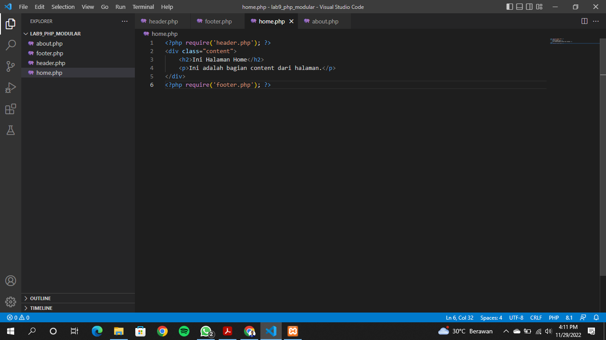

# Lab9Web

## PHP Modular
Buat file baru dengan nama header.php

Hasilnya akan seperti ini

Buat file baru dengan nama footer.php

Hasilnya akan seperti ini

Buat file baru dengan nama footer.php

Hasilnya akan seperti ini

Buat file baru dengan nama about.php

Hasilnya akan seperti ini

## Implementasi
Konsep modularisasi ini kita implementasikan pada kode program praktikum 8 tentang
database, sehingga setiap halamannya memiliki template tampilan yang sama.  
Hasilnya akan seperti ini

